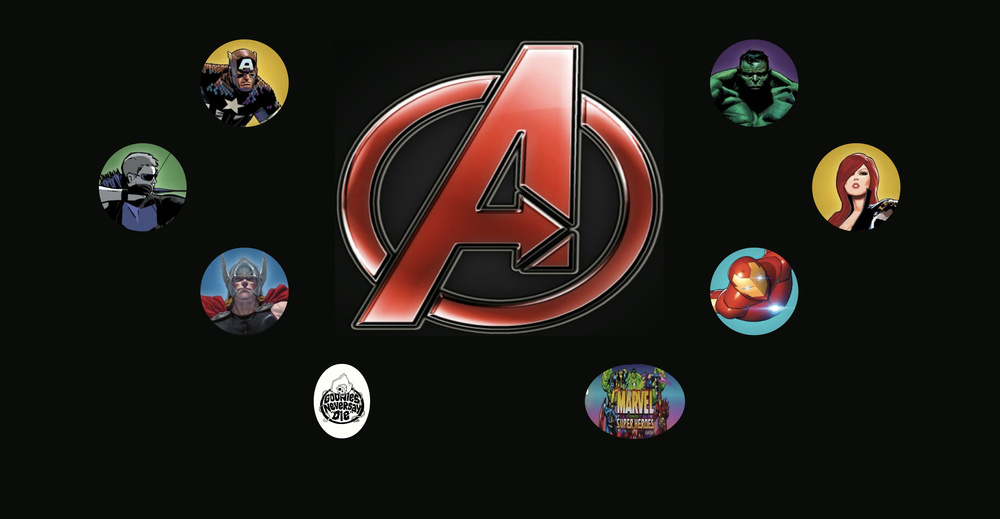
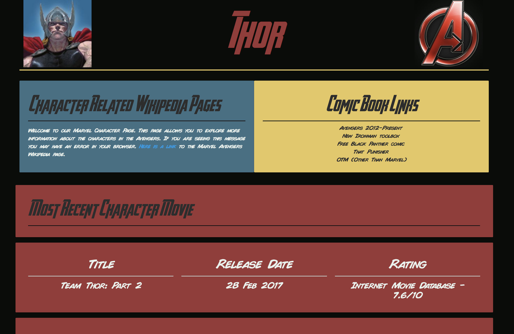

# Avengers Assembler

The Avengers Assembler application is using HTML/CSS and Materialize for a front end framework. Node.js and Express for the backend. 

## Getting Started
 

## Screen Shots




### Prerequisites

```
- Node.js - Download the latest version of Node https://nodejs.org/en/
- Materialize - Add CDN link to HTML http://materializecss.com/getting-started.html
```

## Built With

* Visual Studio Code - Text Editor
* Materialize - Wireframe
* MySql Workbench - Database

## Authors

* **Toney K** - *HTML/JS/Node.js* - [Toney K](https://github.com/ToneyK)
* **Nick B** - *HTML/JS/Node.js* - [Nick B](https://github.com/nick-d-brown)
* **Shawn C** - *HTML/JS/Node.js* - [Shawn C](https://github.com/clickomat)
* **Brooke M** - *HTML/JS/Node.js* - [Brooke M](https://github.com/BrookeMo)
* **Josh C** - *HTML/JS/Node.js* - [Josh C](https://github.com/jmcam80)